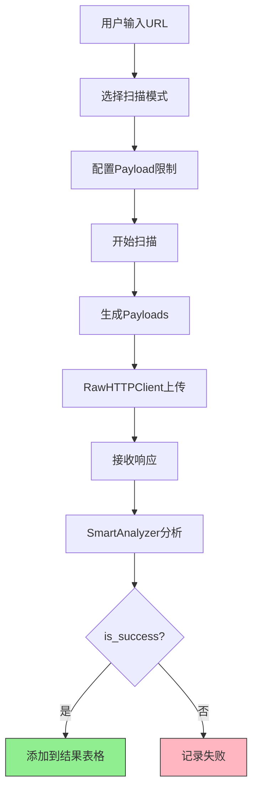
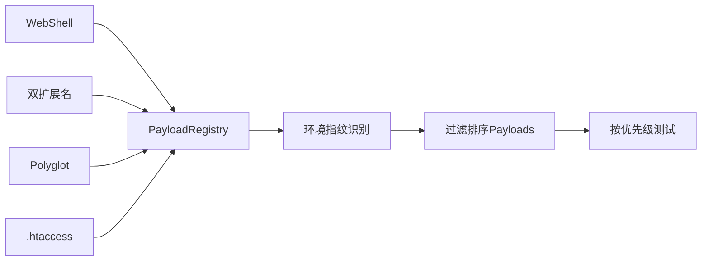
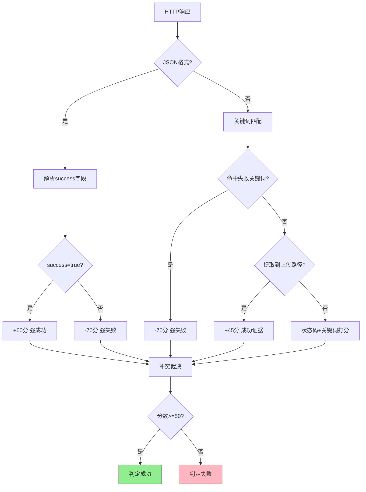

# UploadRanger

一款专业的文件上传漏洞检测工具，支持多种绕过技术检测和自动化扫描。


## 功能特性

- **智能扫描**：自动检测上传点，分析响应内容
  
- **代理抓包**：内置 HTTP/HTTPS 代理，支持拦 截、修改、重放
  
- **Repeater**：手动重放请求，调试绕过技术
  
  
- **Intruder**：自动化爆破，支持多种攻击模式
  
- **263+ 绕过技术**：支持各种文件类型绕过、Content-Type 绕过、WAF 绕过等
  
- **Payload生成器**：支持WebShell、Polyglot等多种载荷生成
  
- **暗色主题**：现代化 UI 设计，长时间使用不疲劳

## 工作原理

### 系统架构



### Payload生成流程



### 响应分析流程



### 核心组件说明

| 组件 | 描述 | 关键功能 |
|------|------|----------|
| **RawHTTPClient** | 字节级HTTP客户端 | 完全控制multipart boundary，支持filename编码绕过 |
| **SmartAnalyzer** | 三级响应分析器 | 状态码权重+关键词匹配+路径提取+置信度打分 |
| **EnvironmentFingerprinter** | 环境指纹识别 | 自动识别Web服务器、OS、语言，动态调整Payload策略 |
| **Payload Registry** | Payload注册中心 | 14类263+种绕过技术，智能排序和过滤 |

## 安装

### 环境要求

- Python 3.8+
- Windows / Linux / macOS

### 安装依赖

```bash
pip install -r requirements.txt
```

或者手动安装：

```bash
pip install "httpx[http2,brotli]>=0.24.0"
pip install "httpcore[asyncio]>=0.17.0"
pip install mitmproxy>=10.0.0
pip install PySide6>=6.4.0
pip install beautifulsoup4>=4.11.0
pip install Pillow>=9.0.0
pip install lxml>=4.9.0
```

### 运行程序

```bash
python main.py
```

或者双击运行 `UploadRanger.bat` (Windows) 或 `UploadRanger.sh` (Linux/macOS)

## 使用说明

### 1. 智能扫描

#### 扫描模式选择

本工具提供两种扫描模式，适用于不同场景：

| 模式 | 用途 | Payload内容 | 适用场景 |
|------|------|-------------|----------|
| **安全测试** | 证明漏洞存在 | 无害的HTML/文本内容 | 授权安全检测、漏洞验证 |
| **渗透测试** | 获取服务器权限 | WebShell等攻击载荷 | 红队评估、授权渗透 |

#### 扫描步骤

1. 在左侧输入目标 URL
2. 选择测试模式：
   - **安全测试模式**：适合授权的安全检测，只上传无害内容
   - **渗透测试模式**：适合红队评估，可自定义WebShell
3. （渗透测试模式）配置WebShell：
   - 设置密码（默认 ant）
   - 选择Shell类型：基础eval、Base64免杀、冰蝎兼容、蚁剑兼容
4. 选择需要测试的后缀文件类型
5. 点击"开始扫描"
6. 查看扫描结果和漏洞详情

#### 渗透模式安全提示

- 上传EXE、脚本等可执行文件前会弹出确认对话框
- 仅在获得授权的环境中使用渗透测试模式
- 安全测试模式生成的Payload不含任何恶意代码

### 2. 代理抓包

#### 启动代理

1. 切换到"代理"标签页
2. 点击"启动代理"按钮
3. 将浏览器代理设置为 `127.0.0.1:8080`

#### HTTPS 证书安装（Windows）

**首次使用 HTTPS 抓包必须安装证书！**

1. **启动代理**后，浏览器访问 `http://mitm.it`（注意是 http 不是 https）
2. 点击 **Windows** 图标下载证书文件（`mitmproxy-ca-cert.p12`）
3. 双击下载的证书文件，打开证书导入向导
4. 存储位置选择：**当前用户**，点击下一步
5. 密码留空，点击下一步
6. **关键步骤**：选择"**将所有的证书都放入下列存储**"
7. 点击"浏览"，选择"**受信任的根证书颁发机构**"
8. 点击确定 -> 下一步 -> 完成
9. 弹出安全警告时点击"**是**"
10. **重启浏览器**，HTTPS 抓包即可生效

#### 抓包操作

- **拦截模式**：开启"拦截请求"后，HTTP/HTTPS 请求会被暂停，等待放行
- **放行 (Forward)**：点击放行按钮，请求继续发送到服务器
- **丢弃 (Drop)**：点击丢弃按钮，请求被丢弃
- **修改后放行**：在请求详情区域修改请求内容，然后点击放行
- **右键菜单**：在拦截列表或历史列表中右键，可发送到 Repeater/Intruder

#### 发送到其他模块

- 在拦截列表或历史列表中选中请求
- 右键选择"发送到 Repeater"或"发送到 Intruder"
- 或点击工具栏的"发送到 Repeater"按钮

### 3. Repeater 重放

1. 切换到"重放"标签页
2. 编辑请求内容
3. 点击"发送请求"
4. 查看响应结果

### 4. Intruder 爆破

1. 切换到"爆破"标签页
2. 在请求模板中用 **§** 标记 payload 位置（如 **§shell.php§**）
   - 可以手动输入 § 符号，或选中内容后点击"标记 §"按钮
3. 配置 payload 列表（可添加多个 payload 集合）
4. 选择攻击模式
5. 点击"开始攻击"

#### 攻击模式说明

- **Sniper (狙击手)**：单点爆破，依次替换每个标记位置
- **Battering Ram (攻城锤)**：全部替换，所有标记位置使用相同 payload
- **Pitchfork (草叉)**：一一对应，多个 payload 列表按位置一一对应
- **Cluster Bomb (集束炸弹)**：笛卡尔积，所有 payload 组合

## 常见问题

### Q: 代理启动报错 "no running event loop"

A: 这是 asyncio 与 QThread 的兼容性问题，已在 v1.0.0 中修复。如果仍有问题，请确保使用的是最新版本。

### Q: HTTPS 网站无法访问，提示证书错误

A: 需要安装 mitmproxy 证书。请按照上面的"HTTPS 证书安装"步骤操作。

### Q: 停止代理按钮没反应

A: 这是跨线程停止的问题，已在 v1.0.0 中修复。使用 `call_soon_threadsafe` 实现安全停止。

### Q: 发送到 Repeater 报错 "httpcore[asyncio]"

A: 需要安装 httpcore 的异步组件：

```bash
pip install "httpcore[asyncio]>=0.17.0"
```

### Q: 扫描速度太慢

A: 可以在设置中调整线程数，或者使用"快速"扫描模式。

### Q: 如何更新 payload 列表

A: 可以在 `payloads/` 目录下编辑对应的 Python 文件，添加自定义 payload。

### Q: 放包后包仍显示在列表中

A: 这是已修复的问题。放包后包会从拦截列表中移除，并在历史列表中显示。

### Q: 历史记录显示"无响应"

A: 确保代理正在运行，并且请求已经收到响应。响应会在收到后自动更新到历史记录中。

### Q: 安全测试模式和渗透测试模式有什么区别？

A: 
- **安全测试模式**：生成的Payload是纯HTML/文本内容，不含任何可执行代码。适合需要证明漏洞存在但不想上传真实WebShell的场景。
- **渗透测试模式**：可以上传真实的WebShell，支持自定义密码和Shell类型（基础eval、Base64免杀、冰蝎兼容、蚁剑兼容）。适合红队评估和授权渗透测试。

### Q: 为什么上传的EXE文件打不开？

A: 安全测试模式下，EXE/脚本等文件生成的是纯文本占位符，不是真实的可执行文件。这是设计如此，用于测试上传接口是否接受该扩展名，不用于实际执行。如需真实测试，请使用渗透测试模式。

## 项目结构

```
UploadRanger/
├── main.py                 # 程序入口
├── config.py               # 全局配置文件
├── requirements.txt         # 依赖列表
├── README.md               # 说明文档
├── gui/                    # GUI 模块
│   ├── main_window.py      # 主窗口
│   ├── proxy_widget.py     # 代理模块（集成）
│   ├── proxy/              # 代理子模块
│   │   ├── __init__.py
│   │   ├── addon.py        # 代理插件系统
│   │   ├── history_tab.py  # 历史记录标签页
│   │   ├── intercept_tab.py # 拦截标签页
│   │   ├── models.py       # 数据模型
│   │   └── proxy_thread.py # 代理线程
│   ├── repeater_widget.py  # 重放模块
│   ├── intruder_widget.py  # 爆破模块
│   ├── traffic_viewer.py   # 流量查看器
│   ├── response_viewer.py  # 响应渲染器（支持Raw/Headers/Render视图）
│   ├── syntax_highlighter.py  # 语法高亮
│   ├── wizard_widget.py    # 向导组件
│   └── themes/             # 主题
│       └── dark_theme.py   # 暗色主题
├── core/                   # 核心模块
│   ├── scanner.py          # 扫描器
│   ├── http_client.py      # HTTP 客户端
│   ├── raw_http_client.py  # Raw multipart HTTP 客户端
│   ├── async_scanner.py    # 异步扫描器
│   ├── async_http_client.py   # 异步 HTTP 客户端
│   ├── response_analyzer.py   # 响应分析器
│   ├── async_response_analyzer.py  # 异步响应分析器
│   ├── async_scanner_worker.py     # 异步扫描工作线程
│   ├── smart_analyzer.py   # 智能响应分析器
│   ├── fingerprinter.py    # 环境指纹识别
│   ├── oob_verifier.py     # 带外验证器
│   ├── auto_verifier.py    # WebShell自动验证器
│   ├── config_manager.py   # 配置管理器
│   ├── models.py           # 数据模型
│   ├── form_parser.py      # 表单解析器
│   └── proxy_server.py     # 代理服务器
├── payloads/               # Payload 模块
│   ├── webshells.py        # WebShell 生成器
│   ├── bypass_payloads.py  # 绕过 payload 生成器
│   ├── polyglots.py        # 多语言 payload 生成器
│   ├── intruder_payloads.py # Intruder专用payload
│   ├── registry.py         # Payload注册中心
│   └── strategy_matrix.py  # 策略矩阵
├── plugins/                # 插件目录
│   └── *.json              # 插件配置
├── test_range/             # 测试靶场
│   ├── app.py              # Flask 靶场应用
│   └── templates/          # HTML 模板
└── assets/                 # 资源文件
    └── *.ico, *.png        # 图标和图片
```

## 依赖说明

### 核心依赖

- **PySide6**: GUI 框架
- **mitmproxy**: HTTP/HTTPS 代理引擎
- **httpx**: 异步 HTTP 客户端
- **httpcore[asyncio]**: httpx 的异步后端

### 其他依赖

- **beautifulsoup4**: HTML 解析
- **lxml**: XML/HTML 解析
- **Pillow**: 图像处理

## 更新说明（v1.1.1）

当前版本：**v1.1.1**（2026-04-09）。本次更新包含：
- **双模式扫描系统**：安全测试模式（上传无害内容）和渗透测试模式（上传WebShell）
- **自定义WebShell密码**：渗透测试模式下可自定义密码和Shell类型
- **智能后缀判定**：自动跳过高置信度后缀，提升扫描效率
- **WAF指纹库增强**：从19个增加到33个，新增国内外主流WAF识别
- **UI优化**：修复按钮显示问题，增强用户体验

**完整更新内容见 [CHANGELOG.md](CHANGELOG.md)。**

## 免责声明

本工具仅供安全研究和授权测试使用。使用本工具进行未经授权的测试是违法的。作者不对任何非法使用承担责任。

## 许可证

MIT License

## 作者

**by bae**  
📧 联系方式：1073723512@qq.com

> 💡 **注意**: 作者平时较忙，如有问题优先提交 [GitHub Issues](https://github.com/Gentle-bae/UploadRanger/issues)，便于有类似问题的师傅互相帮助。

## 打包为可执行文件

### 单文件版本（推荐测试用）

```bash
python build_exe.py --onefile
```

打包后的文件位于 `dist/UploadRanger.exe`

### 目录版本（推荐发布用）

```bash
python build_exe.py
```

打包后的目录位于 `dist/UploadRanger/`，包含所有资源文件

### 清理构建文件

```bash
python build_exe.py --clean
```
