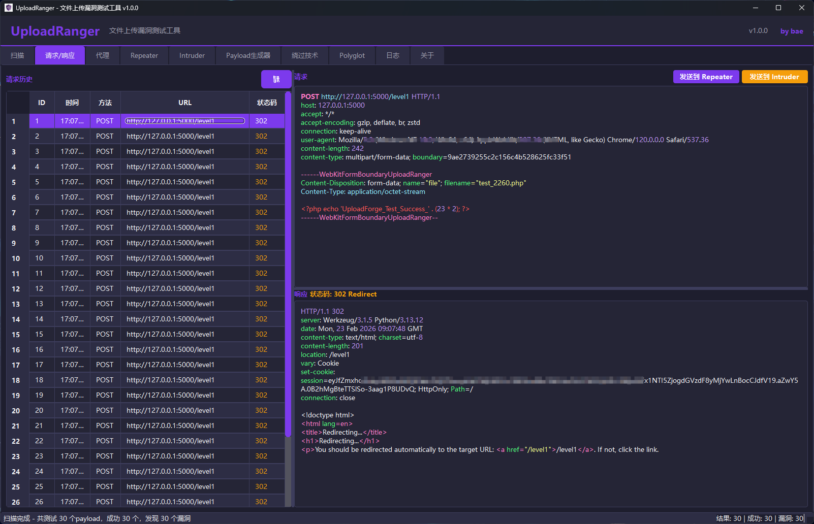
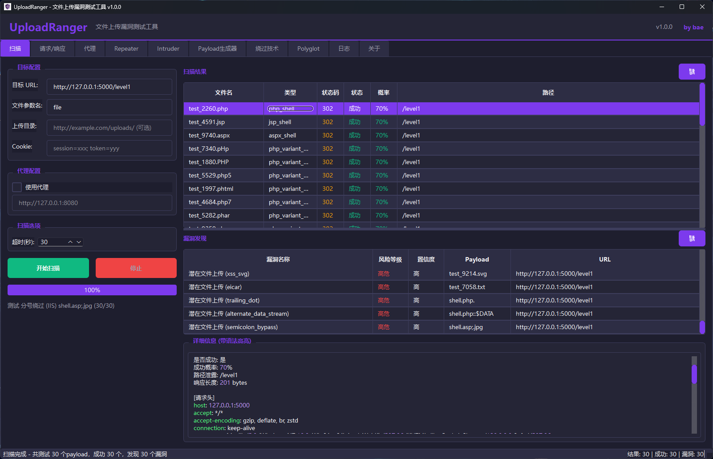
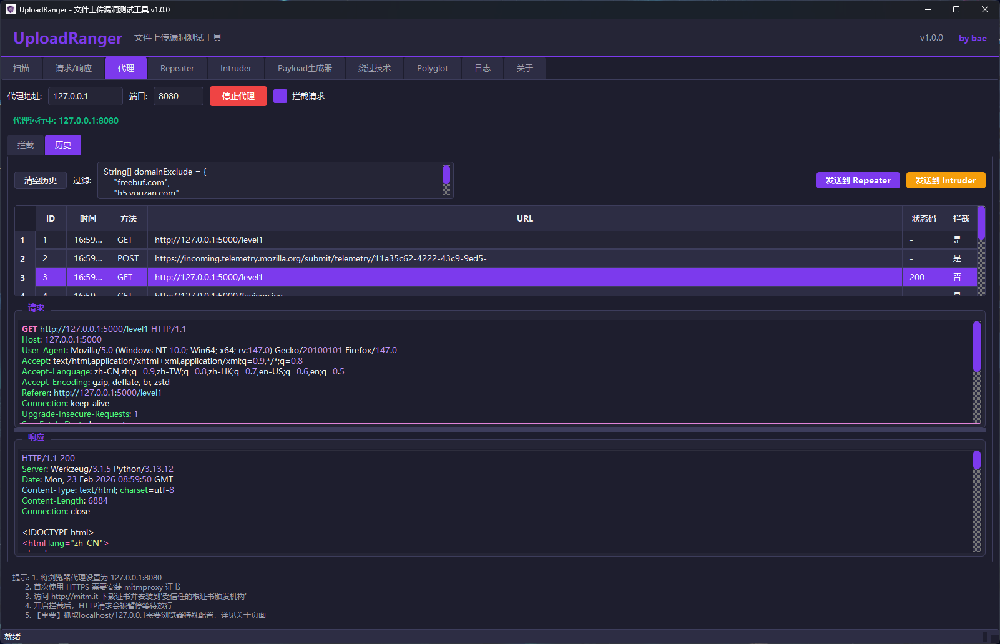
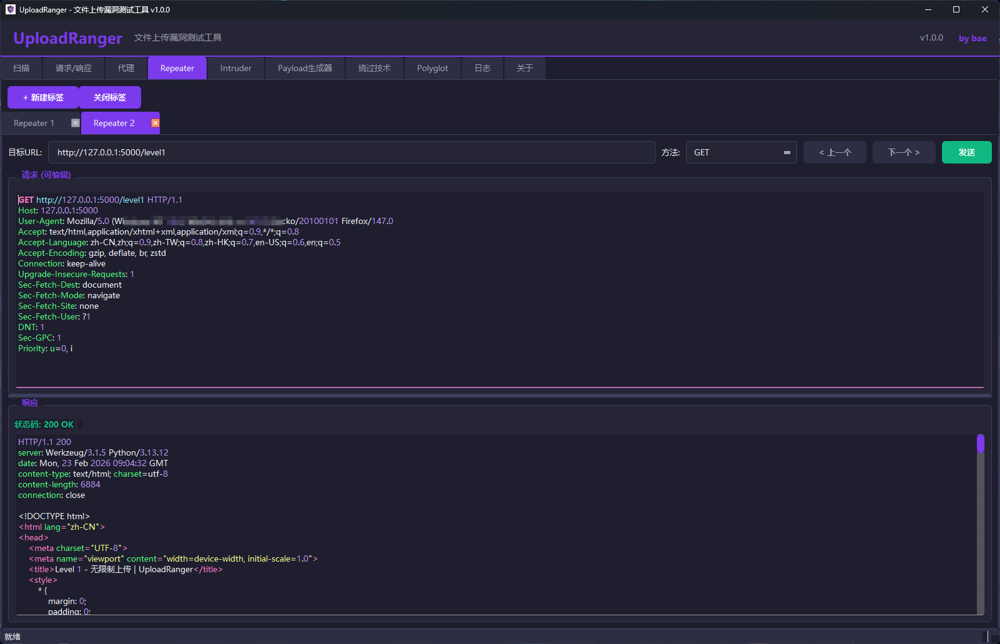
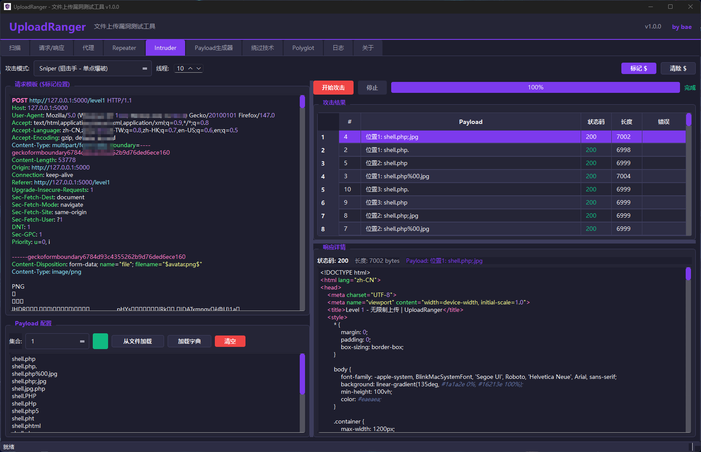
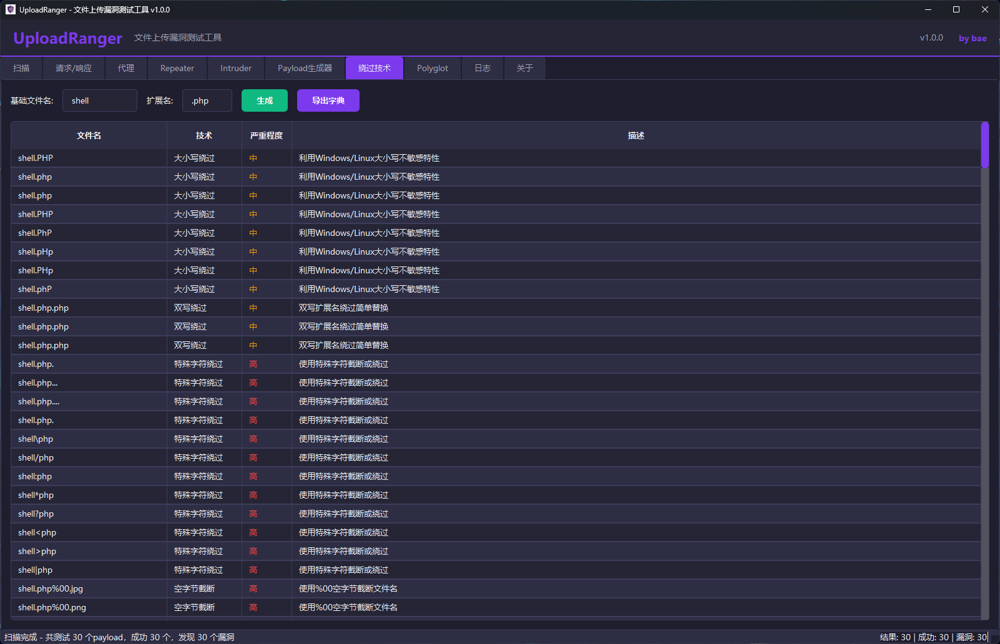
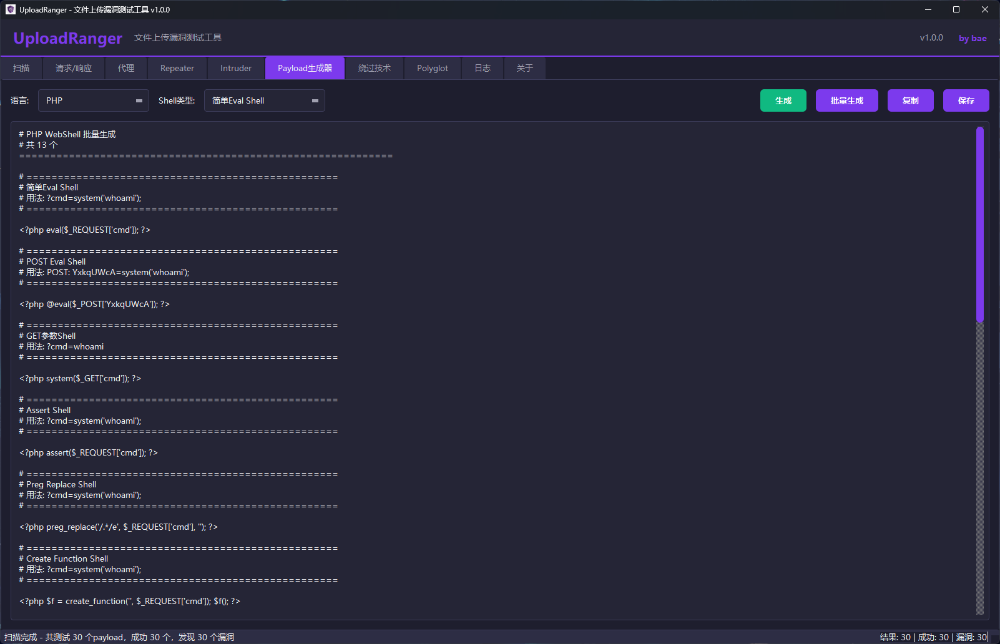

# UploadRanger

一款专业的文件上传漏洞检测工具，支持多种绕过技术检测和自动化扫描。



## 功能特性

- **智能扫描**：自动检测上传点，分析响应内容
  
- **代理抓包**：内置 HTTP/HTTPS 代理，支持拦  截、修改、重放
  
- **Repeater**：手动重放请求，调试绕过技术
  
- **Intruder**：自动化爆破，支持多种攻击模式
  
- **263+ 绕过技术**：支持各种文件类型绕过、Content-Type 绕过、WAF 绕过等
  
- **Payload生成器**：支持WebShell、Polyglot等多种载荷生成
  
- **暗色主题**：现代化 UI 设计，长时间使用不疲劳

## 安装

### 环境要求

- Python 3.8+
- Windows / Linux / macOS

### 安装依赖

```bash
pip install -r requirements.txt
```

或者手动安装：

```bash
pip install "httpx[http2,brotli]>=0.24.0"
pip install "httpcore[asyncio]>=0.17.0"
pip install mitmproxy>=10.0.0
pip install PySide6>=6.4.0
pip install beautifulsoup4>=4.11.0
pip install Pillow>=9.0.0
pip install lxml>=4.9.0
```

### 运行程序

```bash
python main.py
```

或者双击运行 `UploadRanger.bat` (Windows) 或 `UploadRanger.sh` (Linux/macOS)

## 使用说明

### 1. 智能扫描

1. 在左侧输入目标 URL
2. 选择扫描模式（快速/标准/深度）
3. 点击"开始扫描"
4. 查看扫描结果和漏洞详情

### 2. 代理抓包

#### 启动代理

1. 切换到"代理"标签页
2. 点击"启动代理"按钮
3. 将浏览器代理设置为 `127.0.0.1:8080`

#### HTTPS 证书安装（Windows）

**首次使用 HTTPS 抓包必须安装证书！**

1. **启动代理**后，浏览器访问 `http://mitm.it`（注意是 http 不是 https）
2. 点击 **Windows** 图标下载证书文件（`mitmproxy-ca-cert.p12`）
3. 双击下载的证书文件，打开证书导入向导
4. 存储位置选择：**当前用户**，点击下一步
5. 密码留空，点击下一步
6. **关键步骤**：选择"**将所有的证书都放入下列存储**"
7. 点击"浏览"，选择"**受信任的根证书颁发机构**"
8. 点击确定 -> 下一步 -> 完成
9. 弹出安全警告时点击"**是**"
10. **重启浏览器**，HTTPS 抓包即可生效

#### 抓包操作

- **拦截模式**：开启"拦截请求"后，HTTP/HTTPS 请求会被暂停，等待放行
- **放行 (Forward)**：点击放行按钮，请求继续发送到服务器
- **丢弃 (Drop)**：点击丢弃按钮，请求被丢弃
- **修改后放行**：在请求详情区域修改请求内容，然后点击放行
- **右键菜单**：在拦截列表或历史列表中右键，可发送到 Repeater/Intruder

#### 发送到其他模块

- 在拦截列表或历史列表中选中请求
- 右键选择"发送到 Repeater"或"发送到 Intruder"
- 或点击工具栏的"发送到 Repeater"按钮

### 3. Repeater 重放

1. 切换到"重放"标签页
2. 编辑请求内容
3. 点击"发送请求"
4. 查看响应结果

### 4. Intruder 爆破

1. 切换到"爆破"标签页
2. 在请求模板中用 `$` 标记 payload 位置（如 `$shell.php$`）
3. 配置 payload 列表
4. 选择攻击模式
5. 点击"开始攻击"

#### 攻击模式说明

- **Sniper (狙击手)**：单点爆破，依次替换每个标记位置
- **Battering Ram (攻城锤)**：全部替换，所有标记位置使用相同 payload
- **Pitchfork (草叉)**：一一对应，多个 payload 列表按位置一一对应
- **Cluster Bomb (集束炸弹)**：笛卡尔积，所有 payload 组合

## 常见问题

### Q: 代理启动报错 "no running event loop"

A: 这是 asyncio 与 QThread 的兼容性问题，已在 v1.0.0 中修复。如果仍有问题，请确保使用的是最新版本。

### Q: HTTPS 网站无法访问，提示证书错误

A: 需要安装 mitmproxy 证书。请按照上面的"HTTPS 证书安装"步骤操作。

### Q: 停止代理按钮没反应

A: 这是跨线程停止的问题，已在 v1.0.0 中修复。使用 `call_soon_threadsafe` 实现安全停止。

### Q: 发送到 Repeater 报错 "httpcore[asyncio]"

A: 需要安装 httpcore 的异步组件：

```bash
pip install "httpcore[asyncio]>=0.17.0"
```

### Q: 扫描速度太慢

A: 可以在设置中调整线程数，或者使用"快速"扫描模式。

### Q: 如何更新 payload 列表

A: 可以在 `payloads/` 目录下编辑对应的 Python 文件，添加自定义 payload。

### Q: 放包后包仍显示在列表中

A: 这是已修复的问题。放包后包会从拦截列表中移除，并在历史列表中显示。

### Q: 历史记录显示"无响应"

A: 确保代理正在运行，并且请求已经收到响应。响应会在收到后自动更新到历史记录中。

## 项目结构

```
UploadRanger/
├── main.py                 # 程序入口
├── config.py               # 全局配置文件
├── requirements.txt        # 依赖列表
├── README.md               # 说明文档
├── gui/                    # GUI 模块
│   ├── main_window.py      # 主窗口
│   ├── proxy_widget.py     # 代理模块
│   ├── repeater_widget.py  # 重放模块
│   ├── intruder_widget.py  # 爆破模块
│   ├── traffic_viewer.py   # 流量查看器
│   ├── syntax_highlighter.py  # 语法高亮
│   └── themes/             # 主题
│       └── dark_theme.py   # 暗色主题
├── core/                   # 核心模块
│   ├── scanner.py          # 扫描器
│   ├── http_client.py      # HTTP 客户端
│   ├── async_scanner.py    # 异步扫描器
│   ├── async_http_client.py   # 异步 HTTP 客户端
│   ├── response_analyzer.py   # 响应分析器
│   ├── async_response_analyzer.py  # 异步响应分析器
│   ├── async_scanner_worker.py     # 异步扫描工作线程
│   ├── config_manager.py   # 配置管理器，支持JSON格式配置持久化
│   ├── models.py           # 数据模型
│   └── form_parser.py      # 表单解析器
├── payloads/               # Payload 模块
│   ├── webshells.py        # WebShell 生成器
│   ├── bypass_payloads.py  # 绕过 payload 生成器
│   └── polyglots.py        # 多语言 payload 生成器
└── test_range/             # 测试靶场
    ├── app.py              # Flask 靶场应用
    └── templates/          # HTML 模板
```

## 依赖说明

### 核心依赖

- **PySide6**: GUI 框架
- **mitmproxy**: HTTP/HTTPS 代理引擎
- **httpx**: 异步 HTTP 客户端
- **httpcore[asyncio]**: httpx 的异步后端

### 其他依赖

- **beautifulsoup4**: HTML 解析
- **lxml**: XML/HTML 解析
- **Pillow**: 图像处理

## 免责声明

本工具仅供安全研究和授权测试使用。使用本工具进行未经授权的测试是违法的。作者不对任何非法使用承担责任。

## 许可证

MIT License

## 作者

**by bae**  
📧 联系方式：1073723512@qq.com

## 打包为可执行文件

### 单文件版本（推荐测试用）

```bash
python build_exe.py --onefile
```

打包后的文件位于 `dist/UploadRanger.exe`

### 目录版本（推荐发布用）

```bash
python build_exe.py
```

打包后的目录位于 `dist/UploadRanger/`，包含所有资源文件

### 清理构建文件

```bash
python build_exe.py --clean
```

## 更新日志

### v1.0.2 (2026-03-08)

- **代理修复（关键）**: 修复代理停止后无法重新启动的问题，彻底解决 `Task was destroyed but it is pending!` 警告，使用 `run_coroutine_threadsafe` 实现线程安全的任务取消
- **配置持久化**: 新增 ConfigManager 配置管理器，代理设置自动保存和恢复
- **过滤增强**: 代理历史记录添加过滤启用开关、300ms防抖、统计信息显示
- **导入修复**: 修复相对导入导致的 ImportError 启动错误
- **UI优化**: 修复 Repeater 重命名对话框宽度和绕过技术表格选中样式问题
- **代理修复**: 修复表格选中边框覆盖URL、过滤规则匹配、停止代理清空拦截列表等问题
- **稳定性**: 修复 QThread 崩溃问题，Windows/WSL 环境线程稳定性优化
- **兼容性**: 修复 Linux/WSL 环境下中文乱码问题

### v1.0.1 (2026-02-28)

- **界面修复**: 修复扫描和流量模块中"清除"按钮字体显示不全的问题 (Issue #3)
- **Repeater增强**: 增加标签页拖拽排序和双击重命名功能，提升交互体验 (Issue #2)
- **代码优化**: 优化 Payload 生成器，修复 Webshell 模板缩进冗余问题 (Issue #1)
- **稳定性提升**: 修复启动时的 NameError 警告，移除未使用的模块引用
- **体验升级**: Payload 编辑器升级为 `QPlainTextEdit`，支持多种语言的语法高亮

### v1.0.0 (2026-02-23)

- 初始版本发布
- 支持智能扫描、代理抓包、Repeater、Intruder 四大模块
- 支持 263+ 种绕过技术
- 基于 mitmproxy 实现 HTTPS 代理
- 修复 asyncio event loop 与 QThread 兼容性问题
- 修复代理停止按钮无响应问题
- 修复放包后包仍存留问题
- 修复历史记录响应显示问题
- 添加详细的证书安装说明
